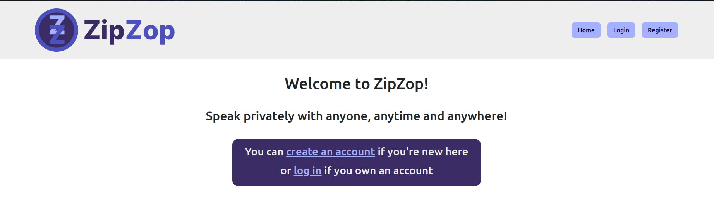
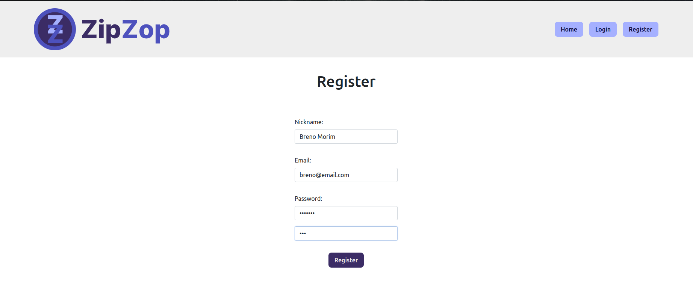
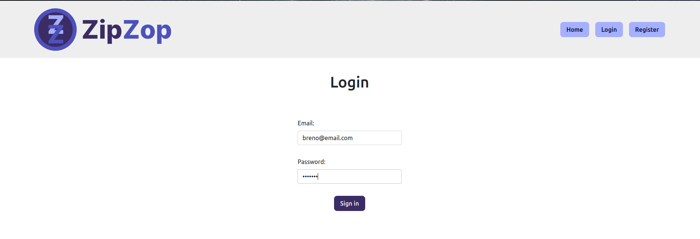
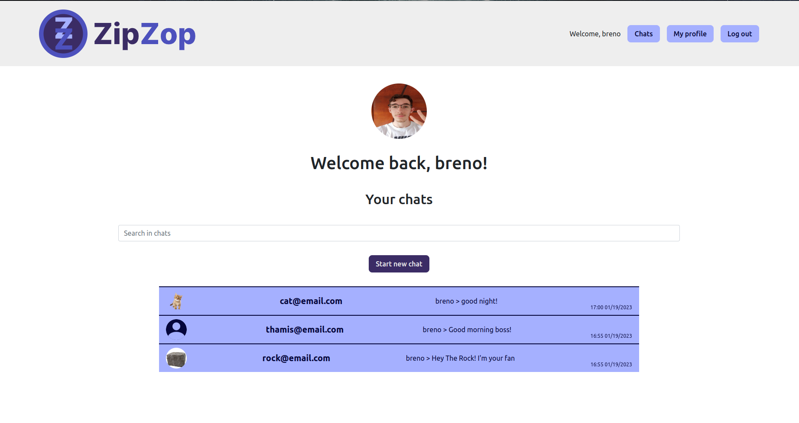
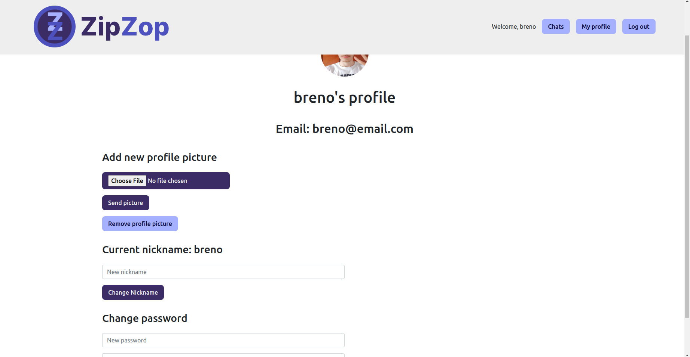
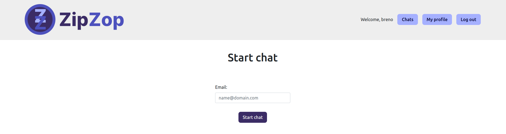
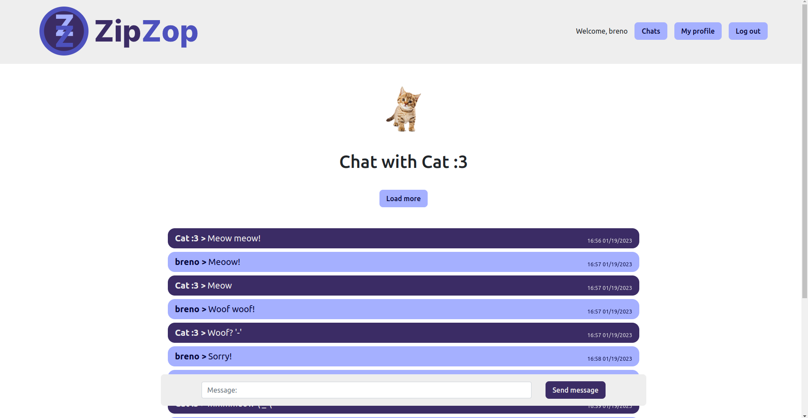

# ZipZop

> Status: Finished

Meu projeto final para o curso CS50, curso de introdução à Ciência da Computação de Harvard, por isso foi feito completamente em inglês. ZipZop é um app de mensagens assim como WhatsApp, desenvolvido em JavaScript com Web Sockets.

| :placard: Vitrine.Dev |     |
| -------------  | --- |
| :sparkles: Nome        | **ZipZop**
| :label: Tecnologias | JavaScript, WebSockets, Socket.io, HTML, CSS


## Video Demo:  <https://youtu.be/f2vSc1veIpo>

### Project Description

My CS50 final project: ZipZop is a messaging app inspired by WhatsApp, here in Brazil some people like to call it this way, that's why I've chosen this name for my final project. ZipZop was developed in JavaScript, Express was used to instantiate a server and make the HTML page accessible, socket.io made it possible to send and receive messages in real time by using WebSockets and event-oriented programming. For the database, I used sqlite3, with the library better-sqlite3 to connect to it and execute the commands. Crypto was used to protect messages with encryption and BCrypt to hash passwords. The logo design and the planning for the project were done with Figma. Bootstrap helped with some default styles, such as inputs and the font-family.

---

## Features

- send messages safely to anybody
- message encryption and decryption
- login and register
- password hashing
- start chats with whoever you want
- inclusion and display of profile picture
- update of personal data
- search for a specifig chat
- sorting and pagination in chat messages
- responsive pages available in desktop and mobile

---

## Security Features

- SQL injection: By using prepared statements and libraries to execute queries, user input is sanitized before being put in the SQL commands.
- XSS: When displaying the user information and messages, it's important to use the textContent attribute instead of innerHTML. Directly changing the innerHTML can make it possible for users to inject and run malicious JavaScript code using script tags inside messages, for example.
- Password hashing: All the passwords are hashed before being inserted in the database, it's a one way operation, so a hacker can't discover the password easily.
- Message encryption: The messages are encrypted when inserted, only decrypted when requested by the front-end. This encryption utilize a key and an initialization vector, both provided through environment variables.
- No routes nor query parameters: Routes and query parameters can be utilized in many exploits, so ZipZop was developed as a SPA (Single Page Application), which means the pages never reload, only specific parts change when needed. Getting data only with JavaScript and not with query parameters.
- Encoding images with base64: base64 makes it easier to display messages in HTML, besides that, it prevents users from injecting malicious scritps disguised as images, and even if they manage to achieve that, the code won't be executed. Storing images in a database instead of the file system, makes it harder for hackers to access them as well.

---

## Pages

### Home (not logged) - Greets the user, contains links to login and register



### Register - For those new to the app



### Login - Simple login page



### Home (logged) - Shows the chats of the user



### Profile - Where you can change your personal data



### Start chat - Where you can start a chat with your friend



### Chat - Shows the messages of a specific chat



---

## Project structure

- node_modules: contains all the dependencies.
- project-images: images to display here.
- public: contains static JS, HTML and CSS files.
  - assets: images used in the pages.
    - complete-logo.svg: Logo with the text.
    - default-profile-picture.svg: Displayed when the user doesn't have a profile picture.
    - favicon.ico: Appears alongside the title in the browser.
    - logo.svg: Only the logo.
  - css: CSS files.
    - chat.css: CSS for the chat page.
    - chats.css: CSS for the logged homepage.
    - form.css: CSS for the register and login forms.
    - header.css: CSS for the header.
    - index.css: CSS for the not logged homepage.
    - notification.css: CSS for the notifications.
    - profile.css: CSS for the profile page.
    - styles.css: Encapsulates the imports of the other CSS files, sets variables and contains global styles.
  - js: JavaScript files.
    - chatpage.js: loads the chat page containing the last 12 messages of the chat, more can be loaded. This is where you can send messages to other people.
    - header.js: Dynamically insert the header, changing if the user is logged or not.
    - homepage.js: Renders the chats of the user, allows searching for a specific chat.
    - index.js: Is imported in the index.html file, loads the socket-index.js scripts, also contains helper functions, such as date formatting and notifications displaying.
    - pages.js: Contains a JSON with all the "skeleton" of the HTML pages, which will be injected in the main tag later with JS.
    - profile.js: Renders the profile page with the user data, here the user can change his nickname, password and profile picture.
    - scripts.js: Contains an object with simple scripts to make simpler pages functional, such as index, login, register and new-chat.
    - socket-frontend.js: Encapsulates all the communication with the back-end. Contains lots of short functions to emit and listen to events using Socket.io. Is used by almost all the other JS files.
  - index.html: Technically, the only route of the application, contains the containers which will be filled dynamically with JavaScript, such as header, main and notification.
- src: Includes all the back-end related files.
  - db: Contains database related files.
    - db-schema.js: Exports a string with the commands to create the tables: users, chats and messages; and the indexes as well, to make queries more performatic.
    - db.js: Connects to the database and exports it.
  - service: Includes helper functions related to security and database manipulation.
    - authenticationService.js: Uses BCrypt to hash passwords and verify them to login. The key and Initialization Vector must be provided by environment variables.
    - chats.js: Operations related to the messages and chats tables.
    - encryptionService.js: Uses Crypto to encrypt and decrypt messages.
    - user.js: Operations related to the users table.
    - userDto.js: Sanitizes the user data, avoiding the leakage of sensible data, such as the hashed password. Guarantees only the necessary information of the user is returned to the front-end.
  - app.js: Instantiates the server, loads both the db.js and socket-backend.js files. The port used by the server can be configured with environment variables.
  - socket-backend.js: Emits and listens to all the events that come from the front-end. Calls functions from db and service to make all the application work.

---

## Running project

```sh
git clone https://github.com/BrenoMorim/zipzop.git zipzop
cd zipzop
npm install
npm start
```

---

### That's it =)

- My GitHub profile: <https://github.com/BrenoMorim>
- My Linkedin: <https://www.linkedin.com/in/brenomorim/>
- My portfolio: <https://cursos.alura.com.br/vitrinedev/brenomorim13>
